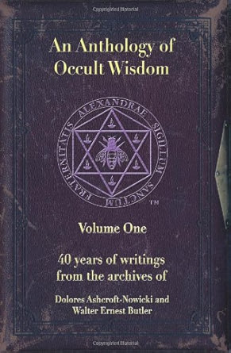

# オカルトの英知選集 ── Anthology of SOL

このリポジトリは、英国の秘教団体「Servants of the Light（SOL）」において伝えられた講義・思想の翻訳Zineをアーカイブするものです。  
訳者はかつてSOLに所属し、2012年に翻訳許可を受けた上で作成されたテキスト群を「知られざる呪術師」の名のもとに再編・公開しています。  

> 💬 **ご案内：全文翻訳をご希望の方へ**  
> 本Zineは、視認性と伝達性を重視し、原典講義の要点を再構成した形式で公開しています。  
> 原文講義の全文翻訳（未公開原稿）は、訳者「知られざる呪術師」の手元にございます。  
> 学術研究・再編集・出版等のご関心がある方は、お気軽にご連絡ください。

---

 

---

## 📚 収録内容

| Volume | タイトル | 内容概要 |
|--------|----------|---------|
| [vol-00](./vol-00.md) | 序文・献辞・解説 | 出版に至る経緯やドロレス女史の言葉、編集方針など |
| [vol-01](./vol-01.md) | 完全な視覚 | 視覚化・記憶・象徴を通じて魔術的知覚を育てる方法論 |
| [vol-12](./vol-12.md) | 魂の進化としての魔術 | イニシエーション後の霊的進化についての高次講義 |
| [vol-19](./vol-19.md) | 心の中の宇宙 | 五感と記憶、潜在意識を活用した実践的感覚の鍛錬 |

---

## 📘 原典情報

本Zineで取り上げている講義は、以下の書籍に収録された内容に基づいて再構成・翻訳されたものです。

 

📖 *An Anthology of Occult Wisdom*  
by Dolores Ashcroft-Nowicki  
[Amazon.com 商品ページ](https://www.amazon.com/Anthology-Occult-Wisdom-Dolores-Ashcroft-Nowicki/dp/0967752345)

※ 本Zineは営利目的ではなく、学習・教育目的の範囲内で要約・翻訳・再構成を行っております。

---

## 🕯️ 訳者について

> **知られざる呪術師（Le Sorcier Inconnu）**  
> 長年にわたり翻訳・実践・教育を通じて、西洋神秘学の知恵を現代に橋渡しすることを試みている。  
> 本リポジトリはその一環として、SOL講義のエッセンスを後世に遺す試みです。

---

## ⚖️ 注意事項

- 本資料は非営利・学術目的での公開を意図したものです。
- 商業利用や無断転載、全文の転用はご遠慮ください。
- 著作権に関する問題等が発生した場合は速やかに削除対応いたします。

---
© 2025 知られざる呪術師（Le Sorcier Inconnu）  
本ドキュメントは [Creative Commons BY-SA 4.0](https://creativecommons.org/licenses/by-sa/4.0/deed.ja) に基づき公開されています。
